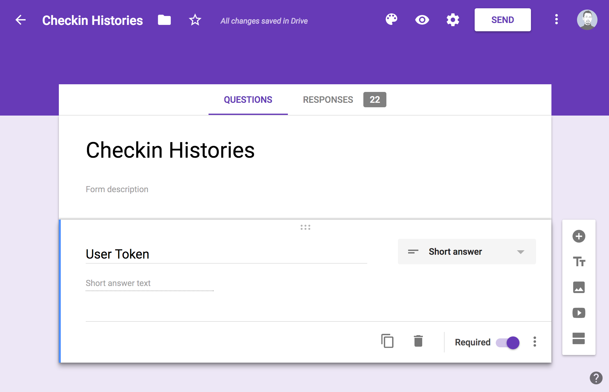
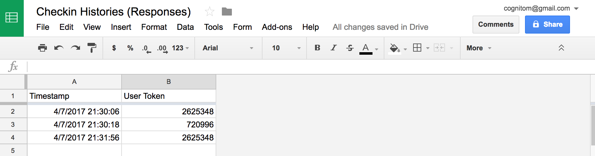

# Mornin

> Check-in! Mornin'!

`mornin` was made for a simple check-in system for our coworkers, and this is just a kind of data logger, and the data will be posted into Google Forms directly.

Imagine that there's a card reader connected to a RasPi at the counter in your office. In the morning, you will come to the office and touch your card to the reader. That's it!

Here're basic building blocks for example:

- Mifare card for each coworker
- Mifare card reader (USB HID)
- `mornin` on Raspberry Pi (or Mac)
- Google Forms

You could use a barcode scanner instead of Mifare. We can use any devices which is recognized as a HID device.

## Install

Install `mornin` globally:

```bash
$ npm install -g mornin
```

## Create a form

1. Create a new form on [Google Forms](https://docs.google.com/forms/u/0/)
2. Add a `Short answer` field to store a card id. Take a field name as you like: ex. "User Token"



**Note**: you don't have to add a timestamp field because it will automatically appear in its spreadsheet.

## Configure

Save your own configuration file as `~/.mornin.json` like below:

```json
{
  "formId": "XXXXXXXXXXXXXXXXXXXXXXXXXXXXXXXXXXXXXXXXXXXXXXXXXXXXXXXX",
  "fieldId": "entry.000000000",
  "vendorId": 65535,
  "productId": 53
}
```

- `formId`: the id of Google Forms. If your form's public URL is `https://docs.google.com/forms/d/e/XXXX/viewform?usp=sf_link`, `formId` would be `XXXX`.
- `fieldId`: the id of the field to post. You can find it from your form's public page. If the page has `<input type="text" ... name="entry.000000000">`, `fieldId` would be `entry.000000000`.
- `vendorId`: see below.
- `productId`: see below.

### vendorId and productId

To study your device's `vendorId` and `productId`, run the command below:

```bash
$ sudo mornin check
```

You would get results like this:

```bash
Checking your HID devices...

# Apple Internal Keyboard / Trackpad by n/a
- vendorId:  1452
- productId: 626

# SYC ID&IC USB Reader by Sycreader RFID Technology Co., Ltd
- vendorId:  65535
- productId: 53
```

**Note**: be sure that your device is connected before running this command.

## Start

Start `mornin`.

```bash
$ sudo mornin
```

You may need to consider to use [forever](https://www.npmjs.com/package/forever) to keep it up.

## Check-in history

Visit your spreadsheet attached to the form:



## License

MIT © Tsutomu Kawamura

This repository includes these sounds licensed under [CC BY 3.0](https://creativecommons.org/licenses/by/3.0/).

- ok sound: [Level Up 01](https://www.freesound.org/people/rhodesmas/sounds/320655/) by rhodesmas
- ng sound: [CARTOON-BING-LOW.wav](https://www.freesound.org/people/kantouth/sounds/106727/) by kantouth
